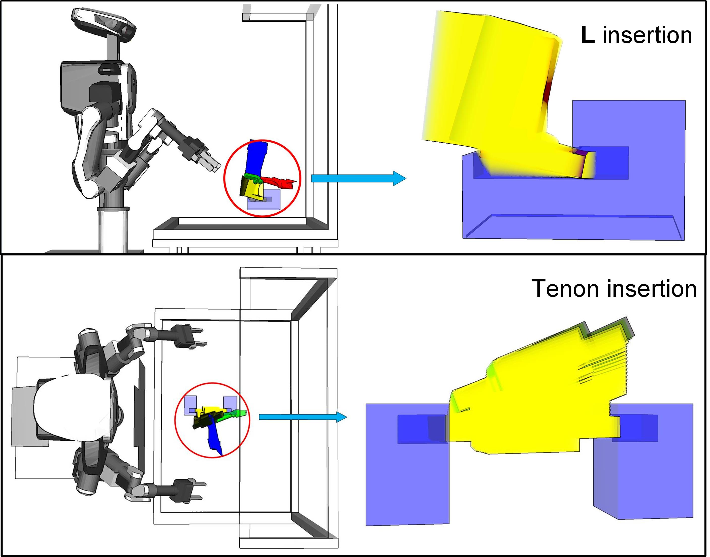
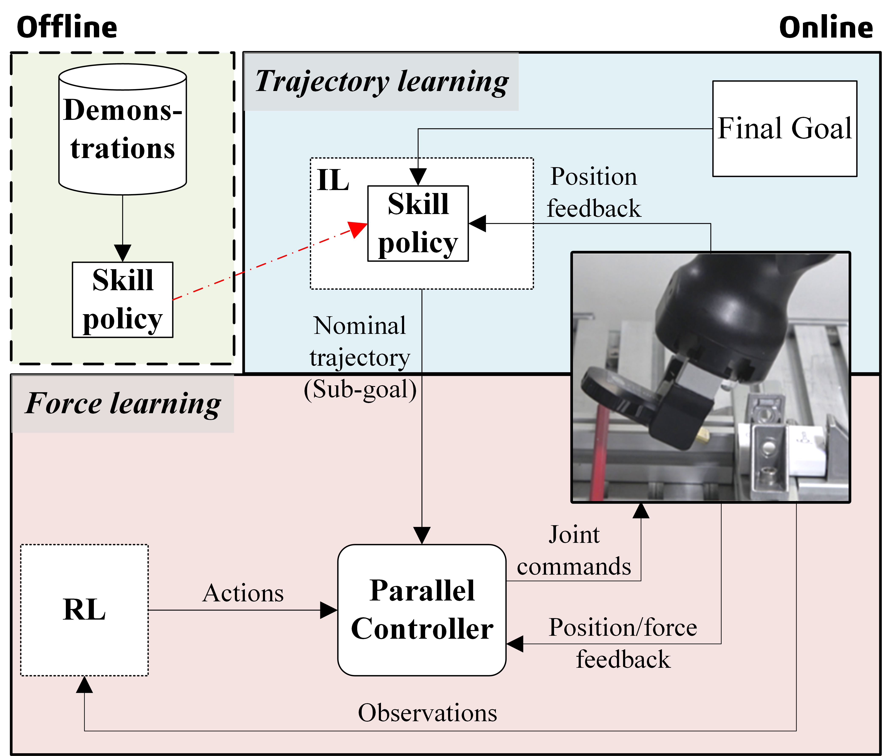

My research focus is on robotic imitation of human assembly skills. Nowadays, the cell production has become an important ingredient of lean manufacturing, which involves many human assembly skills. To make industrial robots automatically complete such product assembly processes, we need to transfer human skills to robots in proper ways.

# Motion Planning through Human Demonstration

In this work, we develop a novel motion planning approach using human demonstration, which can be utilized to complete skillful motions in robotic assembly tasks. The effectiveness of the presented method is verified through experiments on L insertion, tenon insertion, and peg-rotation tasks in the physical world.
  

  

# Robotic Imitation of Human Assembly Skills

The main contribution of this work is the development of a framework that combines hierarchical imitation learning, to learn the nominal motion trajectory, with a reinforcement learning-based force control scheme to learn an optimal force control policy, that can satisfy the nominal trajectory while adapting to the force requirement of the assembly task.
Through experimental validations on both the simulated environment and the real hardware, we corroborate that the proposed learning-based framework is robust to uncertainty in the assembly task, can generate high-quality trajectories, and can find suitable force control policies, which adapt to the task's force requirements more efficiently.
  

